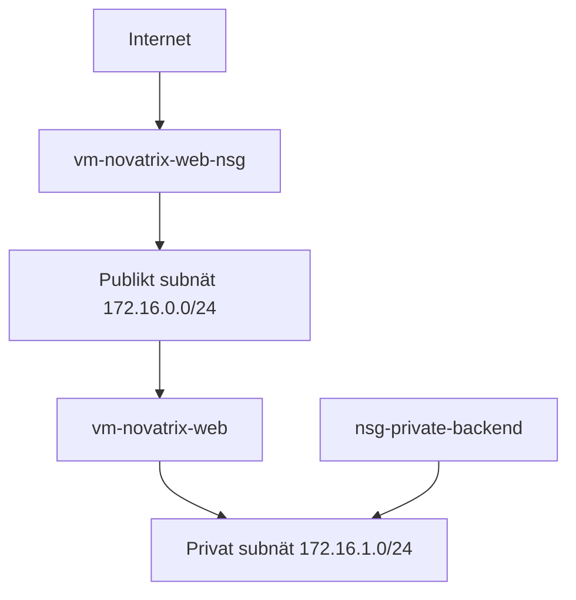

# azure-novatrix

Microsoft Azure course – Novatrix AB  

Student: Farideh Dehghannejad

## Week 34 – Uppgift 1: Compute och kom igång

Azure-miljön och resursgruppen `rg-novatrix` skapades under vecka 34. En virtuell server med tillhörande nätverksresurser körs i regionen Sweden Central.

## Week 35 – Uppgift 2: IAM och identitet

### Microsoft Entra ID

Följande användare och grupper skapades:

- Användare: `Drift Novatrix`

- Användare: `Utveckling Novatrix`

- Grupp: `Novatrix-Dri
- Grupp: `Novatrix-Utveckling`

Användarna placerades i respektive grupp för att behörigheter ska kunna hanteras via grupper i stället för individuellt.

### RBAC och least privilege

Rollerna tilldelades på resursgruppen `rg-novatrix`:

| Grupp | Azure-roll | Omfattning | Motivering |

|---|---|---|---|

| `Novatrix-Drift` | `Deltagare` (Contributor) | `rg-novatrix` | Driftteamet behöver kunna skapa, ändra och hantera resurser, men ska inte kunna tilldela behörigheter till andra. |

| `Novatrix-Utveckling` | `Läsare` (Reader) | `rg-novatrix` | Utvecklingsteamet behöver kunna se resurser och konfigurationer men inte ändra eller radera dem. |

Rollerna följer principen om least privilege eftersom varje grupp endast har den åtkomst som krävs för arbetsuppgifterna.

### Hanterad identitet

En användartilldelad hanterad identitet skapades:

- Namn: `id-novatrix-app`

- Resursgrupp: `rg-novatrix`

- Region: `Sweden Central`

- Tilldelade roller: inga

Identiteten ska senare användas av applikationen för åtkomst till lagring utan användarnamn, lösenord eller andra hemligheter i koden.

### Verifiering

Behörigheterna verifierades med funktionen **Kontrollera åtkomst** i Azure IAM:

- `Novatrix-Drift` har rollen `Deltagare`.

- `Novatrix-Utveckling` har rollen `Läsare`.

- Rollernas omfattning är resursgruppen `rg-novatrix`.

- Den hanterade identiteten har ännu ingen behörighet.

## Week 36 – Uppgift 3: Nätverk och säkerhet

### Virtuellt nätverk

Lösningen använder det befintliga virtuella nätverket `vnet-swedencentral-1` i resursgruppen `rg-novatrix`. Nätverkets adressutrymme är `172.16.0.0/16`.

Två subnät används:

- `snet-swedencentral-1` – `172.16.0.0/24` – publikt subnät för webbservern och kontaktformuläret.

- `snet-private-backend` – `172.16.1.0/24` – privat subnät för framtida lagring och backend.

### Nätverksdesign

### Säkerhetsregler

Webbserverns NSG heter `vm-novatrix-web-nsg`.

Tillåten inkommande trafik:

- HTTP, TCP port `80`, från Internet.

- HTTPS, TCP port `443`, från Internet.

- SSH, TCP port `22`, endast från administratörens aktuella publika IP-adress.

All annan inkommande trafik blockeras av standardregeln `DenyAllInBound`.

Det privata subnätet skyddas av `nsg-private-backend`. NSG:n är kopplad till `snet-private-backend`. Ingen publik resurs är placerad i det privata subnätet.

### Verifiering

- Webbplatsen och kontaktformuläret kunde nås via HTTP på `http://57.174.208.71`.

- SSH-regeln ändrades från `Any` till `My IP address`.

- HTTPS-regeln skapades på port `443`.

- HTTPS-testet gav `ERR_CONNECTION_REFUSED`. NSG:n tillåter porten, men webbservern har ännu ingen aktiv TLS-konfiguration eller giltigt certifikat. Detta dokumenteras som en blockerare och ska åtgärdas innan produktionsdrift.

### Defense in depth

Säkerheten bygger på flera lager:

1. Separata publika och privata subnät.

2. En särskild NSG för webbservern.

3. En separat NSG för det privata subnätet.

4. Begränsad administrativ SSH-åtkomst.

5. Standardregeln blockerar all övrig inkommande trafik.

6. Backend och lagring kan senare placeras utan publik IP-adress.

## Week 37 – Uppgift 4: Storage

### Syfte

Kundtjänstformuläret har kopplats till Azure Blob Storage så att kundärenden och valfria bilagor kan sparas på ett säkert sätt.

### Lagringslösning

- Storage account: `stnovatrixfarideh37`

- Region: `Sweden Central`

- Prestanda: `Standard`

- Redundans: `LRS`

- Åtkomstnivå: `Hot`

- Privat container: `novatrix-arenden`

Standard valdes eftersom detta är en mindre demonstrationslösning med låg trafik. LRS ger låg kostnad och är tillräckligt för skoluppgiften. Hot valdes eftersom testinformationen ska kunna nås direkt.

### Integration med webbplatsen

Webbservern använder Nginx och en Python/Flask-tjänst. Formuläret skickar namn, e-post, meddelande och en valfri bilaga till servern.

- Ärenden lagras som JSON-filer i mappen `arenden/`.

- Bilagor lagras i mappen `bilagor/`.

- Maximal filstorlek är 5 MB.

### Säker åtkomst

Containern tillåter ingen anonym åtkomst. Den användartilldelade hanterade identiteten `id-novatrix-app` är kopplad till den virtuella datorn `vm-novatrix-web`.

Identiteten har rollen `Storage Blob Data Contributor` endast på containern `novatrix-arenden`. Detta följer principen om minsta möjliga behörighet. Inga lagringsnycklar, lösenord eller SAS-token sparas i koden.

### Verifiering

Ett testärende skickades via webbplatsen `http://57.174.208.71`.

Ärendenummer: `20260914-095213-f80789fd`

Följande blobbar skapades:

- `arenden/20260914-095213-f80789fd.json`

- `bilagor/20260914-095213-f80789fd-users.csv.csv`

Testet visar att webbformuläret, Flask-tjänsten, Managed Identity och Azure Blob Storage fungerar tillsammans.

### Begränsning

Webbplatsen använder för närvarande HTTP. HTTPS med ett giltigt TLS-certifikat bör konfigureras innan lösningen används i produktion.

